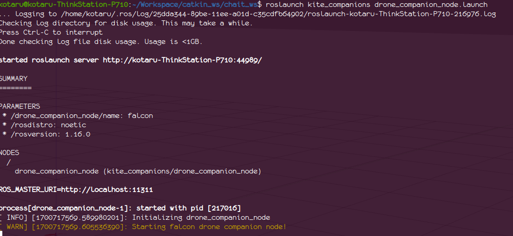

# Example Launches

Table of Contents
=================
- [Example Launches](#example-launches)
- [Table of Contents](#table-of-contents)
    - [Spawning an sdf model.](#spawning-an-sdf-model)
    - [Spawning and controlling a quadrotor model.](#spawning-and-controlling-a-quadrotor-model)
    - [Spawning and controlling a quadrotor with cable suspended payload model.](#spawning-and-controlling-a-quadrotor-with-cable-suspended-payload-model)


### Spawning an sdf model.
Spawning an sdf model from `kite_description/models/`, using `roslaunch kite_sim spawm_sdf.launch model:=<model-name>`

```
roslaunch kite_sim spawm_sdf.launch model:=falcon
```

### Spawning and controlling a quadrotor model.
1. Spawn a quadrotor model (falcon) in gazebo, in a new terminal,
    ```
    roslaunch kite_sim spawm_sdf.launch model:=falcon
    ```
    <p float="left">
       
    </p>

2. ROS launch a companion node to control the quadrotor model in gazebo, in a new terminal,
    ```
    roslaunch kite_companions drone_companion_node.launch
    ```
    <p float="left">
      
    </p>

3. Open rqt_reconfigure in a third terminal,
    ```
    rosrun rqt_reconfigure rqt_reconfigure
    ```
    <p float="left">
       
    </p>

    - Enable sending offboard commands from companion node to the gazebo model by checking the box (step 1 in the image above).
    - Request takeoff by clicking the checkbox (step 2 in the image above).
    - Change the setpoint position (step 3 in the image above), this step only saves the setpoint in buffer doesn't update it.
    - Update the setpoint position by clicking the checkbox (step 4 in the image above). 

### Spawning and controlling a quadrotor with cable suspended payload model.
