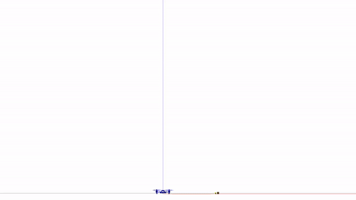
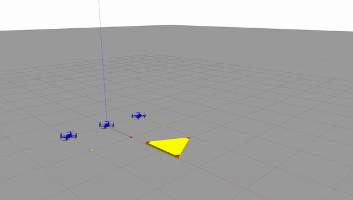

# kite_ros

kite :kite:  alias for CHAIT: **C**able-suspended **H**ybrid **A**erial **I**nflight-grasping and **T**ransportation

ROS1/Gazebo plugins for cable-suspended collaborative aerial manipulation simulations developed for *Dynamics and
Control for Collaborative Aerial Manipulation* dissertation.

This package is particularly designed for payload grasping using cable-suspended grippers and cable-suspended payload
transportation using quadrotor(s).
For vision/learning-supported quadrotor, simulators see the links listed below.

<p float="left">
   
  
  
</p>

### Getting Started

Go to the [wiki](.docs/home.md) for installation and usage instructions.


## Citations

- Dynamics and Control for Collaborative Aerial Manipulation, Prasanth Kotaru, Ph.D. Dissertation, UC Berkeley, December 2022.
  
  ```
  @phdthesis{kotaru2022dynamics,
    title={Dynamics and Control for Collaborative Aerial Manipulation},
    author={Kotaru, Prasanth},
    year={2022},
    school={UC Berkeley}
  }
  ```

---
(c) Prasanth Kotaru
